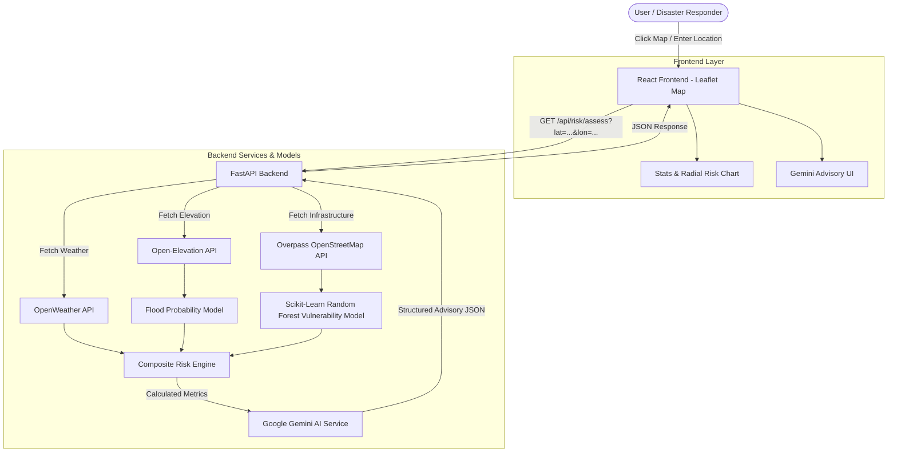

# 🌀 StormSense — Cyclone Risk Assessment & Early Warning Platform

> **Your Intelligent Early Warning System for Tropical Storms.**  
> Leveraging Artificial Intelligence and real-time meteorological data to provide accurate cyclone risk mapping, multi-vector impact prediction, and automated emergency advisories to help communities prepare, respond, and recover faster.

---

## Overview

**StormSense** is an end-to-end geospatial intelligence platform designed for real-time tropical cyclone risk assessment and emergency response coordination. By combining live weather telemetry, elevation profiles, machine learning vulnerability scoring, and Generative AI, StormSense turns raw environmental data into actionable disaster management decisions.

---

## Key Features

1. **Interactive Geospatial Risk Map**
   - Built with **Leaflet** & **React-Leaflet**.
   - Dynamic map click selection with smooth fly-to animations.
   - Dual-ring risk zone overlays (50 km impact radius and 12 km core zone) color-coded by severity (`LOW`, `MEDIUM`, `HIGH`, `CRITICAL`).
   - Custom pulse-animated map pins and interactive popup cards.

2. **Multi-Vector Risk Engine**
   - **Wind Speed & Pressure Scoring**: Evaluates sustained wind velocities and central barometric pressure.
   - **Storm Surge Modeling**: Approximates surge height using pressure deficit and wind speed dynamics.
   - **Flood Probability Model**: Integrates real-time terrain elevation from Open-Elevation API, rainfall intensity, and coastal distance.

3. **Machine Learning Vulnerability Classifier**
   - Powered by a **Scikit-Learn `RandomForestClassifier`**.
   - Assesses localized population density, hospital accessibility, shelter availability ratios, and economic vulnerability indices.

4. **AI-Powered Emergency Advisories**
   - Deep integration with **Google Gemini AI**.
   - Generates structured, location-tailored emergency advisories containing:
     - Plain-language situation summaries.
     - Immediate evacuation and precautionary steps.
     - Precise geographic evacuation zone boundaries.
     - Quantified resource deployment requirements (shelters, medical teams, rescue boats).
     - Response urgency timelines (hours).

5. **Infrastructure Proximity Analysis**
   - Integrates with **OpenStreetMap Overpass API** to discover nearby critical infrastructure (hospitals, road network counts, and power grid nodes).

6. **One-Click Emergency Dispatch**
   - Dispatches real-time alerts to disaster management and emergency response teams.

---

## Technology Stack

### Frontend
- **Framework**: React.js 18 + Vite
- **Styling**: TailwindCSS v4 + Custom Modern CSS
- **Maps**: Leaflet + React-Leaflet
- **Charts**: Recharts (RadialBarChart risk breakdown)

### Backend
- **Framework**: FastAPI (Python 3.10+)
- **Server**: Uvicorn (ASGI)
- **Data Validation**: Pydantic & Pydantic Settings
- **Async HTTP**: HTTPX

### AI & Machine Learning
- **Generative AI**: Google GenAI SDK (`gemini-3.8-flash` / `gemini-flash-latest`)
- **Machine Learning**: Scikit-Learn (`RandomForestClassifier`), NumPy

### External Data APIs
- **Weather Data**: OpenWeatherMap API
- **Elevation Data**: Open-Elevation API
- **Infrastructure**: OpenStreetMap Overpass API

---

## System Architecture



---

##  Project Directory Structure

```text
cyclone-risk-platform/
├── backend/
│   ├── main.py                # FastAPI entry point & CORS middleware
│   ├── config.py              # Environment configuration (Pydantic Settings)
│   ├── .env                   # API keys configuration
│   ├── requirements.txt       # Python dependencies
│   ├── models/
│   │   ├── risk_engine.py     # Composite risk scoring formula & classification
│   │   ├── vulnerability.py   # Scikit-Learn Random Forest vulnerability classifier
│   │   └── flood_model.py     # Elevation & rainfall flood probability estimator
│   ├── routes/
│   │   ├── risk.py            # Main risk assessment endpoint (/api/risk/assess)
│   │   ├── weather.py         # Weather proxy routes
│   │   └── alerts.py          # Alert dispatch routes
│   └── services/
│       ├── weather.py         # OpenWeather API integration
│       ├── infrastructure.py  # Overpass OpenStreetMap API client
│       └── gemini.py          # Google Gemini AI advisory generator
└── frontend/
    ├── index.html             # Main HTML entry
    ├── vite.config.js         # Vite configuration & proxy settings
    ├── package.json           # React dependencies
    └── src/
        ├── main.jsx           # React app mounting point
        ├── App.jsx            # Core application state & layout
        ├── index.css          # Global TailwindCSS & layout styling
        └── components/
            ├── Navbar.jsx          # Header navigation & coordinate search bar
            ├── RiskMap.jsx         # Leaflet interactive map & risk overlays
            ├── StatsPanel.jsx      # Risk breakdown chart & cyclone statistics
            └── GeminiAdvisory.jsx  # AI advisory card & emergency dispatch button
```

---

## Getting Started

### Prerequisites
- **Node.js**: `v18.0.0` or higher
- **Python**: `3.10` or higher
- **npm**: `v9.0.0` or higher

---

### 1. Backend Setup

1. **Navigate to the backend directory**:
   ```bash
   cd backend
   ```

2. **Create and activate a virtual environment** *(optional but recommended)*:
   ```bash
   python3 -m venv venv
   source venv/bin/activate  # On Windows: venv\Scripts\activate
   ```

3. **Install dependencies**:
   ```bash
   pip install -r requirements.txt
   ```

4. **Configure Environment Variables**:
   Create or edit the `.env` file in the `backend/` directory:
   ```env
   OPENWEATHER_API_KEY=your_openweather_api_key_here
   GEMINI_API_KEY=your_google_gemini_api_key_here
   ```
   *(Note: If API keys are omitted, the backend automatically runs in graceful demo mode with mock data and advisories).*

5. **Run the FastAPI server**:
   ```bash
   python3 -m uvicorn main:app --reload --port 8000
   ```
   The backend API will be available at `http://localhost:8000`.

---

### 2. Frontend Setup

1. **Navigate to the frontend directory**:
   ```bash
   cd frontend
   ```

2. **Install Node dependencies**:
   ```bash
   npm install
   ```

3. **Start the Vite development server**:
   ```bash
   npm run dev
   ```

4. Open your browser and navigate to `http://localhost:5173`.

---

## API Endpoints Reference

| Method | Endpoint | Description |
| :--- | :--- | :--- |
| `GET` | `/api/risk/assess?lat={lat}&lon={lon}` | Evaluates cyclone risk, infrastructure, and generates Gemini advisory |
| `POST` | `/api/alerts/dispatch` | Dispatches emergency alert for an assessed location |
| `GET` | `/health` | Health check endpoint returning backend status |

---

## License

This project is open-source and available under the [MIT License](LICENSE).